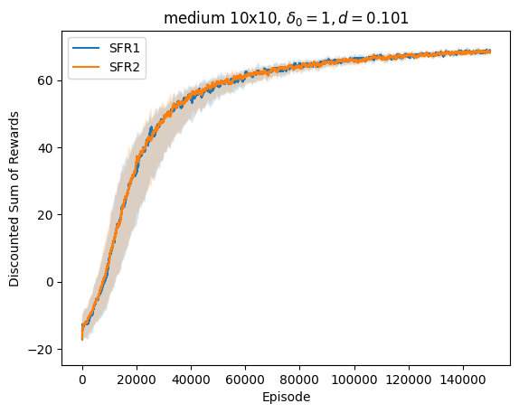
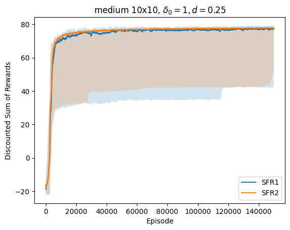
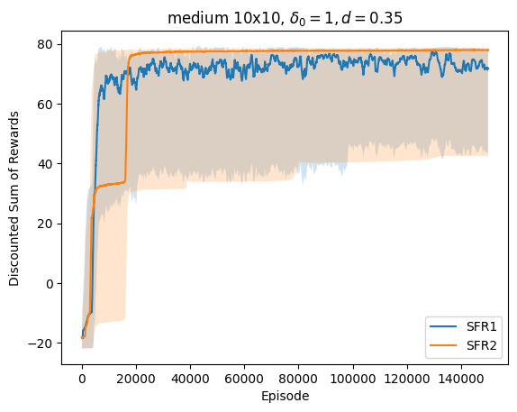
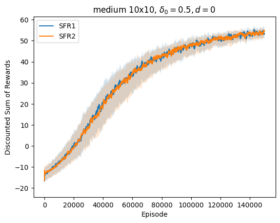
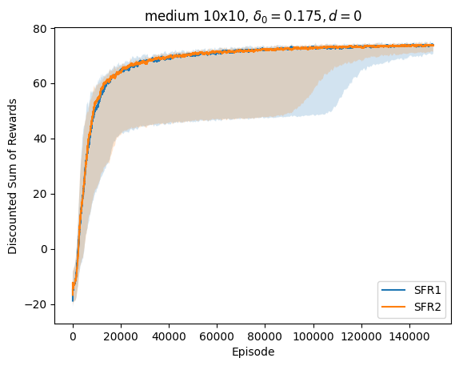
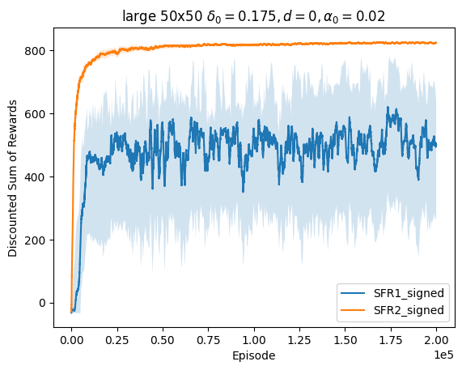
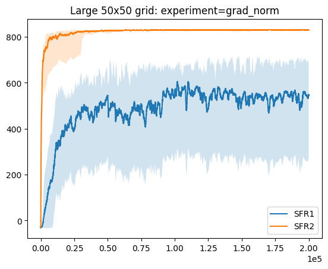

# Smoothed Functional Reinforce
This code repository consists of experiments for the the paper "A Smoothed Functional Reinforce Policy Gradient Algorithm".


<div>
    
    
</div>
<div align="center">Policy Architecture</div>

### Installation
```sh
conda create --name py311 python=3.11
conda activate py311
pip install -r requirements.txt
```

### Running Experiments
Algorithms can be chosen from
- reinforce
- sf_reinforce
- two_sided_sf_reinforce
- ppo

Grid sizes config:

| Config Name | Grid Size    |
|-------------|--------------|
| tiny        | 4 x 4   |
| small       | 8 x 8   |
| medium      | 10 x 10 |
| medium20    | 20 x 20 |
| large       | 50 x 50 |

<div >
    
    
</div>
<div align="center">Rewards for grids</div>
<br>

Each run stores pickle files in the [saves](saves) directory. They are read and displayed by [this notebook](graphs.ipynb).

## Experiments
### 1. Gridsizes
| Algorithm / Gridsize      | 4x4             | 8x8              | 10x10            | 20x20              | 50x50              |
|---------------------------|-----------------|------------------|------------------|--------------------|--------------------|
| PPO                       | -1.08 $\pm$ 2.0 | -11.13 $\pm$ 1.8 | -14.79 $\pm$ 2.4 | -27.27 $\pm$ 4.7   | -41.83 $\pm$ 2.0   |
| reinforce                 | 13.90 $\pm$ 0.1 | 50.74 $\pm$ 2.3  | 76.90 $\pm$ 4.9  | 144.89 $\pm$ 113.8 | -18.79 $\pm$ 8.4   |
| sf\_reinforce             | 13.23 $\pm$ 0.1 | 45.40 $\pm$ 17.7 | 59.80 $\pm$ 35.0 | 220.24 $\pm$ 78.8  | 376.29 $\pm$ 401.4 |
| two\_sided\_sf\_reinforce | 13.26 $\pm$ 0.1 | 45.52 $\pm$ 17.8 | 60.39 $\pm$ 35.0 | 170.68 $\pm$ 127.4 | 562.89 $\pm$ 387.7 |

```sh
# Run all combinations
python main.py sf_reinforce tiny 20000
python main.py two_sided_sf_reinforce small 100000
python main.py reinforce medium 150000
python main.py ppo medium20 150000
```

### 2. Perturbation sizes

#### 2.1 Decay scheme
<div >
    
    
</div>

<div >
    
    
</div>
<div align="center">Different decay schemes for perturbation</div>
<br>

```sh
# run for all values in 0.101, 0.25, 0.35, 0.45
python main.py sf_reinforce medium 150000 --delta_pow 0.25
python main.py two_sided_sf_reinforce medium 150000 --delta_pow 0.35
```

#### 2.2 Constant scheme
<div >
    
    
</div>
<div align="center">Different constant schemes for perturbation</div>
<br>

```sh
python main.py sf_reinforce medium 150000 --const_delta 0.5
python main.py sf_reinforce medium 150000 --const_delta 0.175
python main.py two_sided_sf_reinforce medium 150000 --const_delta 0.5
python main.py two_sided_sf_reinforce medium 150000 --const_delta 0.175
```

### 3. Tranformed gradients
####  3.1 Signed Gradient
<div >
    
    
</div>

<div >
    
    
</div>
<div align="center">Effect of step sizes while performing updates using signed gradients</div>
<br>

```sh
# small step-size
python main.py sf_reinforce large 200000 --sign --alpha 2e-6
python main.py two_sided_sf_reinforce large 200000 --sign --alpha 2e-6

# medium step-size
python main.py sf_reinforce large 200000 --sign --alpha 2e-4
python main.py two_sided_sf_reinforce large 200000 --sign --alpha 2e-4

# medium-large step-size
python main.py sf_reinforce large 200000 --sign --alpha 2e-3
python main.py two_sided_sf_reinforce large 200000 --sign --alpha 2e-3

# large step-size
python main.py sf_reinforce large 200000 --sign --alpha 2e-2
python main.py two_sided_sf_reinforce large 200000 --sign --alpha 2e-2
```

#### 3.2 Gradient clipping

<div >
    
    
</div>
<div align="center">Gradient clipping: by value and by norm</div>
<br>

```sh
python main.py two_sided_sf_reinforce large 200000 --alpha 0.02 --grad_bound 1.5
python main.py sf_reinforce large 200000 --alpha 0.02 --grad_norm 50
```
